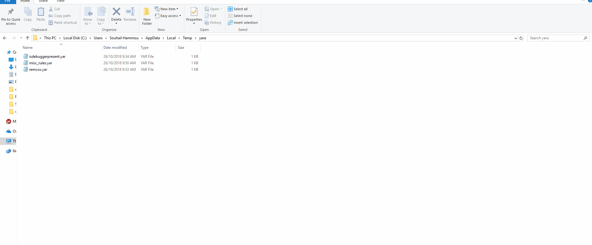

## IDARay : Yet Another YARA plugin for IDA Pro
IDARay is an IDA Pro plugin that matches the database against multiple YARA files which themselves may contain multiple rules. Maybe your rules are scattered over multiple YARA files or you simply want to match against as much rules as possible, IDARay is here to help !

## How to use :
 - Place the plugin in the plugins directory.
 - Create a directory that only contains YARA files.
 - Navigate to Edit->Plugins->IDARay Plugin
 - Choose your directory and you're all set.

## Demo :

